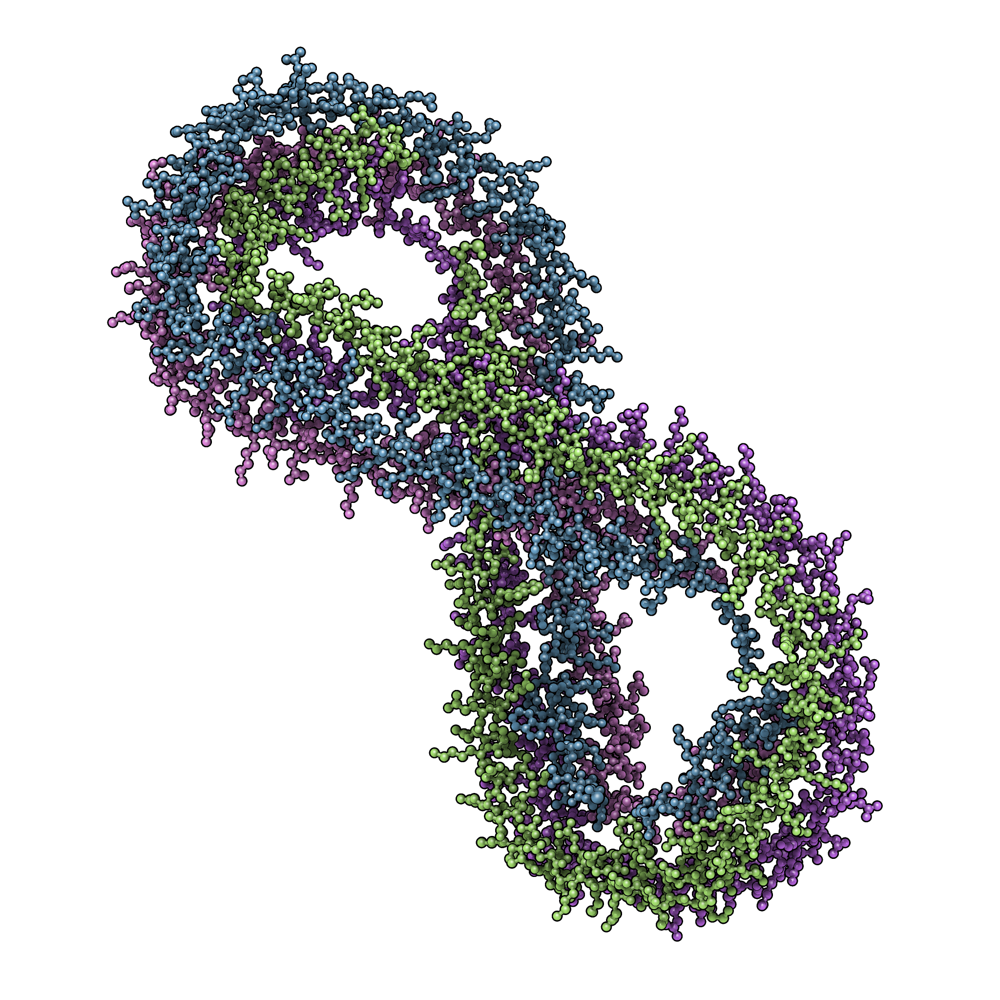

## Ссылки

Программное обеспечение: [QuteMol](https://qutemol.sourceforge.net/)

Белок: [1AV1](https://www.rcsb.org/structure/1AV1)

## Подготовка

Для визуализации структуры белка необходимо:

1. Открыть `QuteMol`
2. Загрузить белок при помощи кнопки загрузки

В результате в окне приложения должна появиться загруженная структура  
(структура большого размера может довольно долго прогружаться)  

## Визуализация

`QuteMol` поддерживает только 3 типа визуализации

- Space-Fill
- Licorice
- Balls'n'Sticks

### Space-Fill

По умолчанию структура белка показывается в представлении Space-Fill  

### Licorice (Wireframe)

В разделе `Geometry` нужно переключиться на `Licorice`  

### Balls'n'Sticks

Что-то среднее между `Space-Fill` и `Licorice`  
В разделе `Geometry` нужно переключиться на `Balls'n'Sticks`  

## Цветовые модели

### CPK

В разделе Geometry в Material Color выбрать Per atom

### Различными цветами по доменам (частям) белка

В том же разделе выбрать Per chain

## Изображение белка публикационного качества

Использовал представление `Balls'n'Sticks`, цветовую модель `Per chain` и пресет `Molecule of the Month`  
  
