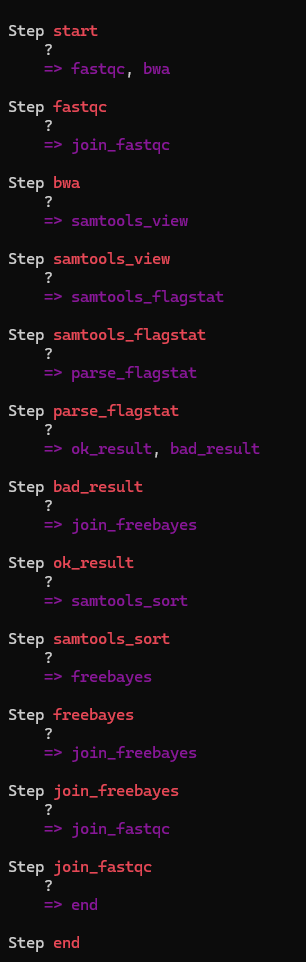
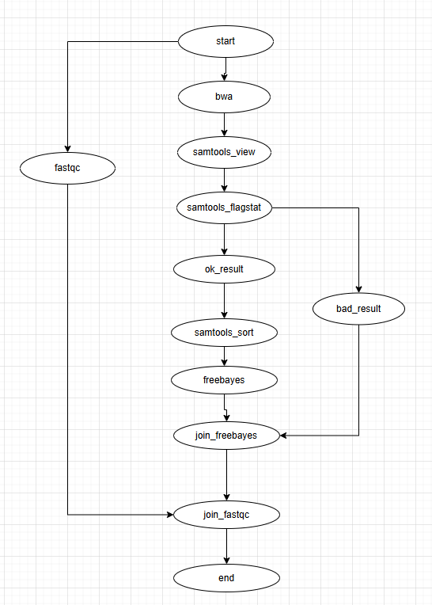

## Ссылки на данные
Набор ридов: https://trace.ncbi.nlm.nih.gov/Traces/?view=run_browser&acc=SRR31200022&display=metadata <br/>
Референсный геном: https://www.ncbi.nlm.nih.gov/assembly/GCF_000005845.2/

## Скрипт на bash
Скрипт для получения генетических вариантов и разбора результатов оценивания: `bash/gen.sh`
Результат команды samtools flagstat: `bash/flagstat.txt`

## Инструкция по  установке фреймворка и запуска hello world
Установите python3, pip и python-venv  
Создайте venv: ``` python3 -m venv venv ```  
Активируйте: ``` source venv/bin/activate ```  
Установите Metaflow: ``` pip install metaflow ```  
Запустите `hello_world.py` из папки `pipeline`: ``` python hello_world.py run ```


## Итоговый пайплайн
Пайплайн для получения оценки качества картирования расположен в папке `pipeline/algos`.

Запуск пайплайна
```
python pipeline.py run --ref_file ecoli.fna --seq_file ecoli.fastq
```

Визуализировать пайплайн можно при помощи команды:
```
python pipeline.py show
```
Но вывод текстовый и не особо читаемый  

  
Так выглядит если перерисовать  
  
В целом схема похожа на схему алгоритма, но добавились ветвления в тех шагах, которые можно выполнять параллельно. Так-же из-за того, что все ветви должны заканчиваться в `end`, добавились join шаги, чтобы слить в конце все параллельные ветви в одну
