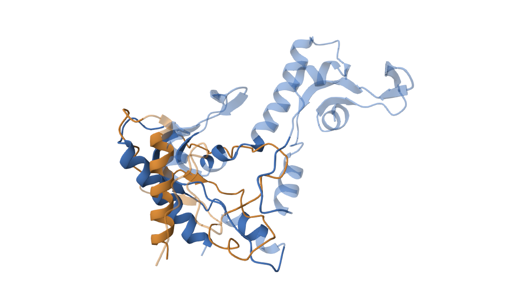

### Последовательность:  
MVEYFGQNLNGFLFTKNAWVQSYGTRCVKPPIVWGDVSRANPITVEWSAYAQSKTDHVMKGMLTGPVTILNWSWPREDITHEEQTKQLALAIRDEVLDLE

### Инструменты фолдинга белков:  

- [ESMFold](https://colab.research.google.com/github/sokrypton/ColabFold/blob/main/ESMFold.ipynb)
- [AlphaFold2](https://colab.research.google.com/github/sokrypton/ColabFold/blob/main/AlphaFold2.ipynb)

### Инструмент парного выравнивания:  [jCE](https://www.rcsb.org/alignment)

### Инструмент визуализации: https://www.rcsb.org/3d-view/

## Предсказанные стркуктуры

### ESMFold  
В папке ESMFold pdb файл с предсказанием и копия блокнота с его получением 

### AlphaFold2
В папке AlphaFold2 pdb файл с предсказанием с первым рангом и копия блокнота  

## Полная выдача программы выравнивания
В папке Alignment

## Снимок экрана с полученным раскрашенным выравниваем из https://www.rcsb.org/3d-view/  
- Оранжевый цвет - ESMFold
- Синий цвет - AlphaFold2

## Гифка  

## Сессия из программы визуализации  
[SESSION](https://www.rcsb.org/alignment?request-body=eJyVkctuwyAQRf%2BFtV%2BJsYO9y6LdddVlFVkYxg%2FJPAq4SRrl3zskqdpd1RVw72jmzOVC3ldwZ9JeiLFhNtrHq4OwOt15QFML6CQPnLTBrXBNiDA6wCnEOmUkkJZYPrvj7IEkREGYjIye5ip6IqqWO3wFcLfuI7ed4qfOz59YURbJTTEW9KzHDg%2B%2BBCSq7jqOAu2R7McpMvQGx0cFOjzasIQ45WUXJgd%2BMgsylIiDY3CvLlqkbZor8nvcQ%2BB%2BgDBvF7K6BTGnEKxv83z14NLVLobLzAnfZ8aN%2Bccml%2Baoo5gXTMqKMprKfiNSWkCTNlXBUsp2VG5qVlS1yJ9eX54RIevFPOD6g3GKY2BEqbvwyOa7zMoeRQ8LiPgFMSPuz6qbkZnsCUL%2FG7NmJaes4Sltqm1Kqxoxi12Vlg3dsrqsOGsg3y924pFg%2Bxfpr8o%2FYQ8x5GFebvkerl%2BVj8s1&response-body=eJzNV9tu4kgQ%2FRc%2FY9P3C29oIEwUyCYBEUVRhBq7IZbAML5kNor49602IRhmwDs8rFa8QHWdU9VV3aeaDy9OZiuv9eEVRRx5LS8kOAqJUb5RXPpMRMY31GrfYjMNpzPFI6K8hpflJi8y8P%2F21%2BCu3x11vU3DW9rcOCqziOfJ0ib5ZLmKLDitTZz%2BjDMLwMqazV9XZUjrwKnNikUOlM8fwJ4WYV6AqfxZpAtwe83zddZqNovMpn6xXqxMFKRhNg1W6bz5hpvR6mfijE1kOJGRnvpqiqY%2BU8j6UzSb%2BTRSoeXcGBXKZnc4uFotomAaxjNIa7ZKlyaHKMvl1hBnk2mcmPTda0EytuElZum2ssOto6krg13YMI9XSbnt7H05KYvY9jabxh%2FnPVMKK6qoj7nmPiNG%2B0YY4s%2B4ZMhKOcOWN9uL9atxGZA%2FTr0Crc3%2BpbFvwuSrZ2U3UjsHiOvM8yGq4U3tfJLZH6UB6%2B3vOIns314LNbyFTeb5q9di3BXnNFKSAyTGao9V56GKHkJpBYoV7OpsypyfSlmeD6vVAZDRPVKcR2IkDqAc76GkBorxIVTsobQGSg%2FrJKtlqgvL5AFWkz22prH4qMAYVUqMcQ1YHoFJJWnCNy9wZPPUJNn2PuyOKG6gz89vv8GJQAHlihGlEZIYKUoYa%2Fgo0EhqKjgTgjKuEXY2giVBmgmClIS7KhxHoDhDnAowIqEVV2AihGmmkYaLK6BeGhwDJjSiGEulOMECc8ACI5WA0UwKiYQi2ygU2AhREJhTyTmWZRCBOJNKCyIZ5QTQItCaggNDgjBONBTXV4FgwK4Z5xxhDH4%2BxgEcMkiNUM4oRCOwa3e9i%2BWy1AiQ23C1k9o3syhsefTz97UTjSxexguTxvm7X7p5rkufXiJA9MvxYTDseE43EtCLZAKEcVTYiZN%2BoJZ4qyn2R2GT8FhSdmagGYy7T1e9%2B9v%2Bbe%2BqfzW6uW0%2Fju%2BHT73Rw7fxzd3d9fix1xkPH9q3d9ejcfdx2H5q3w9vRp3v48FNb9Af9e7Go%2Bv%2B7ePw8e6h27kefe9270c39%2F12v3390OmO%2B51%2B12tUROwyDasRBCIuFQRKLtUDyi6VAyovVgOmLxUDzs5oga6ZEPSMFDiZ9%2BZmvW1udV%2BVgpRdqHZIH9W5Wkl6VMnqmj7OuloNdJpUy9OkGFdY9ebFLf%2FHV%2BR%2FdQ1Pz2WMUc3UEEdTo%2FqYwDW3GKujl8gvz4nfnjNI6ujBcsDBq41%2F2dRKcYDYXo0%2FT4EfR6CdIMpVOSaYB479Xyg3CjD%2FlXSPqFH5AyL9tTga7CKdHgNuwf0rWNhot%2Bi2664%2FDNDtiCiRUCP3YhDuL0MyCVdvNjVziPIMHFS8wDjZ%2FANs8fDK&encoded=true)  

## Краткие выводы о совпадении полученных предсказаний

Предсказания получились довольно разные, хотя схожие участки все-таки есть.  
Ещё я пробовал брать разные ранги предсказаний AlphaFold2, но они все были похожи друг на друга.
