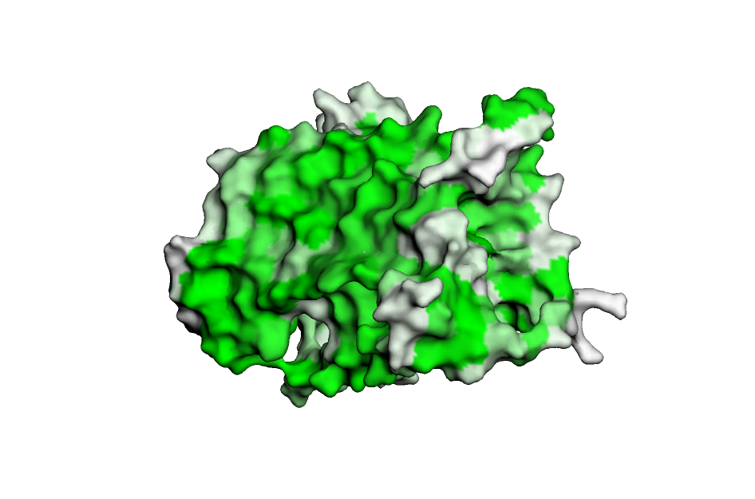
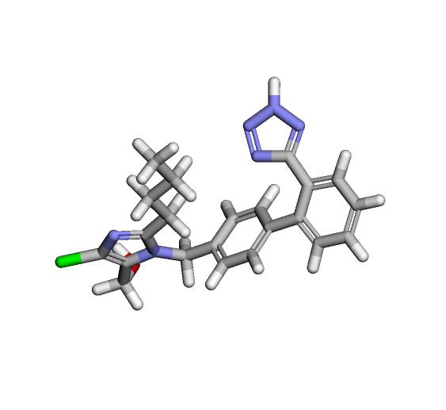
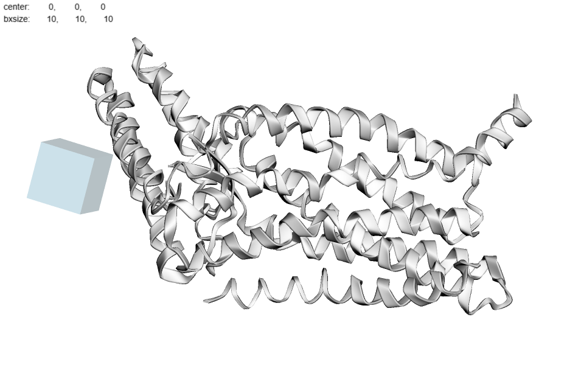
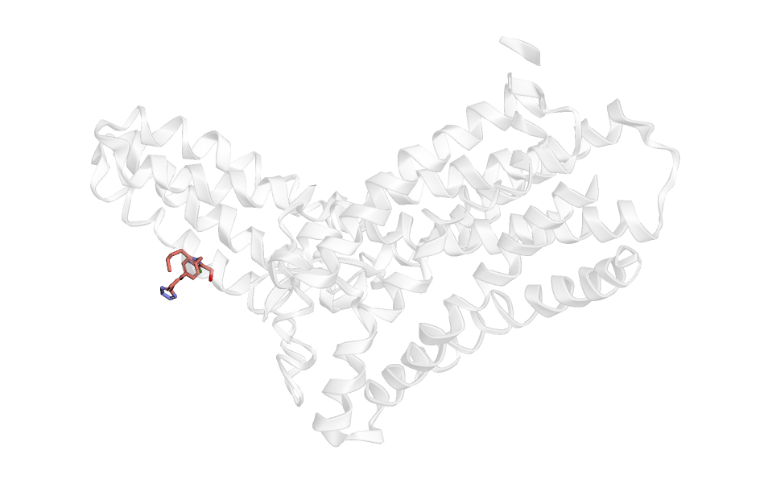

## Полученная информация о препарате

**Наименование препарата:** Лозартан

**Действующее вещество:** Лозартан калия

**Область применения:**
- Лечение гипертонии
- Снижение риска осложнений при сердечной недостаточности
- Защита почек при диабетической нефропатии
- Профилактика инсульта у пациентов с гипертрофией левого желудочка
- Замедление прогрессирования хронической болезни почек

**Молекулярный механизм действия:** Блокирует действие вещества (ангиотензина II), которое сужает сосуды и повышает давление. Это помогает сосудам расслабиться, снижает давление и защищает сердце и почки.

## Полученный ноутбук с выполненным докингом

**Google Colab:** [docking.ipynb](https://colab.research.google.com/drive/1-MewiF9uYOquUgVSx7ZxEprDSK6g_SVI?usp=sharing)

**Файл:** docking.ipynb  

## Результаты докинга
Результаты в папке DOCKING

## Изображения
Трехмерная структура подготовленного таргета

Трехмерная структура исходного лиганда  

Полученный бокс

Полученный докинг

